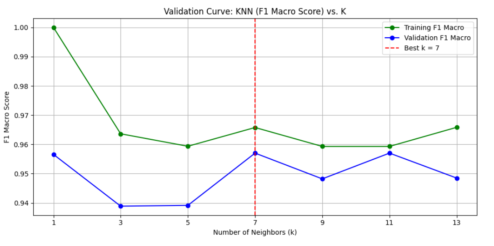
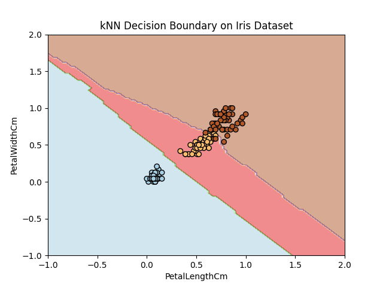
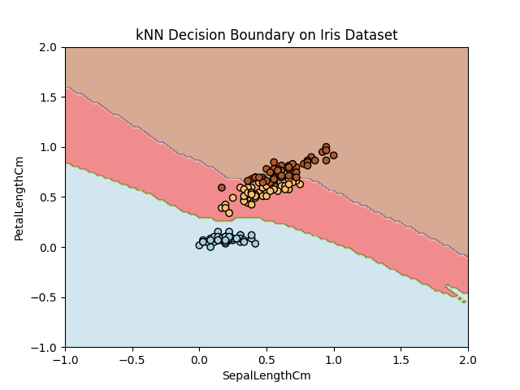
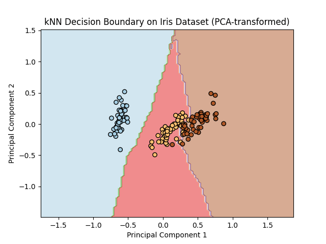

# 🌸 Iris Flower Classification using k-Nearest Neighbors (k-NN)

This repository demonstrates how the **k-Nearest Neighbors (k-NN)** algorithm performs on the **Iris dataset**, including hyperparameter tuning, performance evaluation using cross-validation, and decision boundary visualization with raw features and PCA-transformed data.

---

## 📚 What is k-NN?

**k-Nearest Neighbors (k-NN)** is a simple, intuitive supervised machine learning algorithm used for **classification and regression**. It works by storing all available cases and classifying new cases based on a similarity measure (e.g., distance functions).

### 🔢 How It Works
1. Choose a value for **k** (number of neighbors).
2. For a new data point:
   - Compute distances from the data point to all training samples.
   - Select the **k closest** samples.
   - Predict the class based on **majority voting** among the k neighbors.

---

## 🌸 About the Iris Dataset

The **Iris dataset** is a classic multivariate dataset introduced by Ronald Fisher. It contains **150 samples**, divided equally among three species of Iris flowers:
- *Iris-setosa*
- *Iris-versicolor*
- *Iris-virginica*

Each sample has **4 features**:
- Sepal Length (cm)
- Sepal Width (cm)
- Petal Length (cm)
- Petal Width (cm)

The task is to predict the **species** of iris flowers based on these measurements.

---

## 📈 Validation Curve

To determine the optimal value of **k**, we plotted the **F1 Macro Score** across different values of `k`. Based on the curve below, the best performance is achieved at **k = 7**.

---

## 🗺️ Decision Boundary Visualizations

We visualize decision boundaries to better understand how the k-NN model distinguishes between classes.

### 🌿 Sepal Length vs Petal Length

---

### 🌿 Petal Length vs Petal Width

---

### 🌿 PCA-Transformed Features

---

## ✅ Cross-Validation Evaluation (5-Fold)

| Metric               | Score (± Std)     |
|----------------------|------------------|
| **Accuracy**         | 0.9600 ± 0.0327  |
| **Precision (macro)**| 0.9623 ± 0.0322  |
| **Recall (macro)**   | 0.9600 ± 0.0327  |
| **F1 Score (macro)** | 0.9599 ± 0.0327  |

---

## 🧾 Conclusion

Based on the analysis:

- The best value for **k is 7**, giving the most balanced performance on both training and validation data.
- **Cross-validation results** indicate that the model is consistent and reliable across different folds.
- **Decision boundaries** reveal good class separation, particularly after PCA transformation.

🔍 This project demonstrates that k-NN is a **simple yet powerful** algorithm for small and interpretable datasets like Iris, especially when paired with proper visualization and validation.

---
